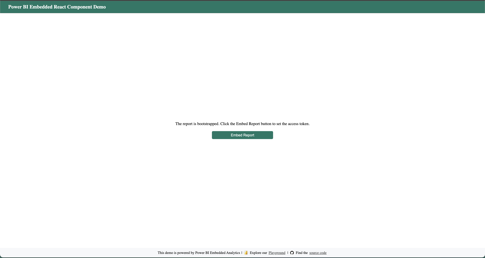

# Power BI Embedded React Demo 2025 [Vite + React + TypeScript]




This example demonstrates how to embed and interact with a Power BI report in a React application using the `powerbi-client-react` library. Key features include:

- **Bootstrap and Embed**: The `App.tsx` sets up a bootstrap configuration. Clicking **Embed Report** prompts for an Embed URL and an access token to load the Power BI report.  
- **Event Handlers Map**: A map of event handlers (`eventHandlersMap`) is provided to capture report events (e.g., `dataSelected`, `pageChanged`).  
- **Control Buttons**: Toggle the report’s features such as theme, zoom, filters, or refresh using the provided buttons.  
- **Dialogs**: Automatically show dialogs for adjusting embed configurations or viewing details of selected data points.  

## How to Run

1. Install dependencies:
   ```bash
   pnpm install
   ```
2. Start the application:
   ```bash
   pnpm dev
   ```
3. Open the browser at http://localhost:3000 to see the report page.

> Use the on-screen controls to interact with the report. The console logs provide additional event information. 

---

## How it Works?

When the **Embed Report** button is clicked, a dialog appears to let you input an Embed URL and an access token. This step initializes the embedding process by:

1. Accepting the provided Embed URL and token.
2. Updating the `sampleReportConfig` with the new credentials.
3. Setting up the report so it’s ready for further interactions (e.g., applying themes or toggling filters).

